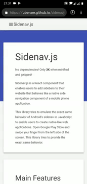

# Sidenav.js

[](https://david-dm.org/ubenzer/sidenavjs#info=devDependencies)
[](https://travis-ci.org/ubenzer/sidenavjs)
[](https://greenkeeper.io/)

Sidenav.js is a React component that enables users add to left side navigation to their website that behaves like a native side navigation component of an Android application. **No dependencies!** Only *3K* when minified and gzipped!
Open Google Play Store and swipe your finger from the left of the screen. This library tries to provide the exact same behavior.



[Hi-res Video](https://www.youtube.com/watch?v=pXpKrVUUHX4)

## Demo
To see a live demo click [here](https://ubenzer.github.io/sidenavjs/) or scan the barcode at the end of the page. Don't forget to try it on your mobile phone too! Swipe your finger from the left of the screen towards the right, just like you Open a sidenav in Android!

## Install

```bash
npm install --save sidenavjs
yarn add sidenavjs
```

## Usage (minimal setup)

```jsx
import React, { Component } from 'react'

import Sidenav from 'sidenavjs'

class Example extends Component {
  constructor(props) {
    super(props)
    this.state = {
      sidebarOpen: false
    }
  }

  onSetSidebarOpen = open => {
    this.setState({ sidebarOpen: open })
  }

  render () {
    return (
      <Sidenav
        open={this.state.sidebarOpen}
        onSetOpen={this.onSetSidebarOpen}
        sidenav={
          <div>sidenav contents</div>
        }
      >
        <div>
          body contents
          <button onClick={() => { this.onSetSidebarOpen(true) }}>
            Click here to open the sidenav
          </button>
        </div>
      </Sidenav>
    )
  }
}
```

## Features
1. Mobile first. Means: The library is small and robust, optimized for fluidity and framerate.
2. Multi-finger handled. Means: We won't confuse your fingers and throw a bunch of exceptions if you
touch with more then one finger.
3. You can open/close sidenav programmatically.
4. You can a attach callback to learn if the user is touching the sidenav.
5. You can a attach callback to learn if an animation in progress or not.
6. Sidenav contains only a minimal CSS bundled with it: You can add your custom classes and styles to make the styling perfect.

## API
You can pass a couple of props to Sidenav.

### sidenav
**Type:** node

**Is required:** Yes

**Default value:** N/A

The provided node will be shown as the content of the sidenav.

### children
**Type:** node

**Is required:** Yes

**Default value:** N/A

The provided node should represent the actual page contents. Sidenav will open alongside the node provided as children. Sidenav expects to be close to the root of the component tree as much as possible. As sidebar opens over the whole page, you should wrap the whole page with the Sidenav component.

### open
**Type:** boolean

**Is required:** Yes

**Default value:** N/A

If true the sidenav will be displayed. You can change the value programmatically to open/close sidenav by your custom logic. (e.g. on button click)

### onSetOpen
**Type:** function(boolean)

**Is required:** Yes

**Default value:** N/A

If the sidenav's open/close state changes due to the user action (e.g. swiping, touching backdrop etc.) this function is called with a boolean value. Calling the
function with *true* means the sidenav is now opened, and calling with *false* means it is closed. **You are expected to update the `open` value with the value
provided by this function.** Please see the example above to see how it works.

### onSetBusy
**Type:** function(boolean)

**Is required:** No

**Default value:** () => {} (noop)

If provided, this function is called by the sidenav when sidenav becomes busy or
when sidenav becomes available again. It will be called with a single boolean variable. `true` represents `sidenav` is busy and `false` represents that it is
available again. In the current implementation, sidebar is "busy" when an animation is in progress. In the future "being busy" may also cover other operations.

### onTouch
**Type:** function(boolean)

**Is required:** No

**Default value:** () => {} (noop)

If provided, this function is called by the sidenav when a touch operation is being handled by the sidenav. It will be called with a single boolean variable. `true` represents `sidenav` is handling a touch and `false` represents that it is
done handling. Please note that this doesn't necessarily mean that user is touching the sidenav itself. The user might be dragging from the left side of the screen or touching the backdrop as well. As long as a touch is handled by the library this callback will be notified.

### options
**Type:** object

**Is required:** No

**Default value:** [Click here](https://github.com/ubenzer/sidenavjs/blob/master/src/index.js#L26)

Options are used to customize sidenav's behavior to your liking. `options` is an object and accepts a couple of different keys. **Please note that you can't change options after rendering Sidenav component.** This is an intentional choice mostly for performance reasons. If you need to change an option for some reason you should remove and re-render the component.

#### options.extraClosePixels
**Type:** number

Due to styling that overflows out of sidenav, such as shadows, swiping sidebar out of screen might not be enough. Although sidenav is swiped out of the screen, its shadow might still leak into the screen. Due to this reason, you can provide `extraClosePixels`.

#### options.width
**Type:** number

This number determines the width of the sidebar. If not provided, the width of the `sidenav` node will be automatically calculated and used.

#### options.backdropOpacity
**Type:** number between 0 and 1

This number determines the opacity of the backdrop when it is fully deployed.

#### options.sidenavClass
**Type:** string

If you want to provide a class name for the sidebar element, you can do so.

#### options.sidenavStyle
**Type:** object

If you want to provide styling to the sidebar element, you can do so. The object should follow react's style attribute conventions.

#### options.backdropStyle
**Type:** object

If you want to provide styling to the backdrop element, you can do so. The object should follow react's style attribute conventions.

#### options.contentStyle
**Type:** object

If you want to provide styling to the children (content), you can do so. The object should follow react's style attribute conventions.

#### options.dragStartSensitivity
**Type:** number

The number of pixels on the left side of the screen that is sensitive to swiping right. Due to humans fingers being big, swiping from the left side of the screen doesn't really start from the 0th pixel on the left. This setting is used to set how many pixels should trigger dragging from the left, thus displaying the sidenav.

If the number is too small, people won't be able to easily swipe from left to display the sidenav. If the number is too big regular movements (scrolling etc.) might be mistakenly detected as sidenav swiping.

#### options.swipeSensitivity
**Type:** number

If sidenav is swiped with a certain amount of speed, even when it is not half way through it'll still open/close. This number adjusts the sensitivity to that. The number's measurement unit is "pixel difference per touch event". I am aware that this doesn't mean much. Better to increase/decrease and find the good fit yourself. :-)


#### options.defaultAnimationSensitivity
**Type:** number

Sidenav animation reacts to the swipe speed of the user. If the user takes a rapid action, the animation is gradually speeded up to fit the user's rhythm for a more native-like experience. This number is used to adjust the reaction difference. The number itself is multiplayer in an equation. It is better to play with it and see the difference.

## Setting up the development environment
0. Discuss the change that you want to introduce. You can open an issue for that.
1. Fork the project.
2. Run `npm i` in the project root and in `example` folder.
3. Run `npm start` in the project root and in `example` folder in two different consoles. This will start a test app where you can check your changes alongside with the actual component.
4. Browse http://localhost:3000 to see your changes.
5. Develop something.
6. Make a pull request.

## Contributing
Just open a PR or a ticket.

## License

MIT © [ubenzer](https://github.com/ubenzer)

## Your barcode to the demo

